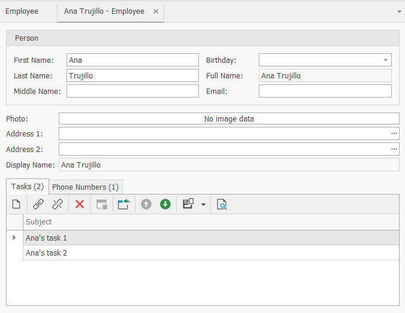
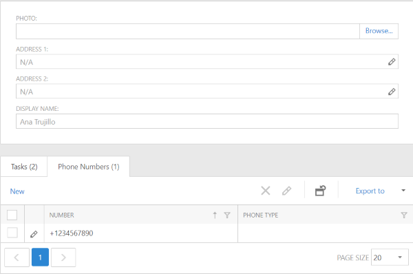

# XAF - How to show the number of nested List View items in tab captions

In this example, we demonstrate how to show the number of nested List View items in tab captions. 

* *WinForms:*

* *ASP.NET:*

You can add, delete, link or unlink items in nested List Views, or move between different records in the Detail View. The record count in tab caption will be automatically updated. For implementation details, review the following platform-dependent controllers: [EmployeeDetailViewWinController.cs](./DetailViewTabCount/WinForms/CS/DetailViewTabCount.Module.Win/Controllers/EmployeeDetailViewWinController.cs) for WinForms applications, [EmployeeDetailViewWebController.cs](./DetailViewTabCount/ASP.NET/WebForms/CS/DetailViewTabCount.Module.Web/Controllers/EmployeeDetailViewWebController.cs) for ASP.NET WebForms applications, and [EmployeeDetailViewBlazorController.cs](./DetailViewTabCount/ASP.NET/Blazor/DetailViewTabCount.Module.Blazor/Controllers/EmployeeDetailViewBlazorController.cs) for ASP.NET Core Blazor applications. For implementation details, refer to the following links:
* [Module](./DetailViewTabCount/Module) 
* [WinForms](./DetailViewTabCount/WinForms) 
* [ASP.NET WebForms](./DetailViewTabCount/ASP.NET/WebForms) 
* [ASP.NET Core Blazor](./DetailViewTabCount/ASP.NET/Blazor) 
